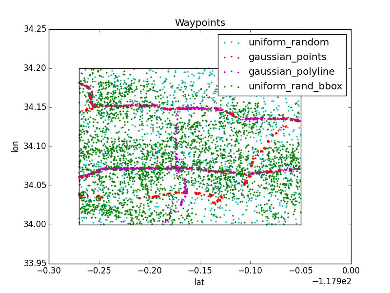

synthetic-traffic
=================

We are working on producing a set of synthetic urban traffic networks and corresponding data for benchmarking and evaluation purposes.

For example usage, please see:

[Convex optimization for traffic assignment](https://github.com/cathywu/traffic-estimation)

[Bayesian inference for traffic assignment](https://github.com/cathywu/traffic-estimation-bayesian)

[Compressive sensing for traffic assignment](https://github.com/pcmoritz/traffic-project)

Also, see our [contributors](AUTHORS.md)!

Contents
--------
1. [General dependencies](#generaldependencies)
2. [Toy networks](#toynetworks)
3. [Grid networks](#gridnetworks)
4. [Waypoints](#waypoints)
5. [Grid networks in UE] (#gridnetworksue)

1. General dependencies
-------------------
    
We use Python 2.7.

    scipy
    ipython
    matplotlib
    delegate
    

2. Toy networks
------------

Coming soon!

3. Grid networks
-------------

Dependencies for grid networks

    networkx

Usage

    python static_matrix.py --prefix '' --num_rows <# ROWS OF STREETS> \
        --num_cols <# COLUMNS OF STREETS> \
        --num_routes_per_od <# ROUTES BETWEEN ODS> \
        --num_nonzero_routes_per_o <# ROUTES WITH NONZERO FLOW PER OD>

Example

    python static_matrix.py --prefix '' --num_rows 2 --num_cols 2 \
        --num_routes_per_od 3 --num_nonzero_routes_per_o 3

Example grid network

4. Waypoints
---------

Dependencies for waypoint

    pyshp

Load map via Shapefile

    run -i find.py

Find new roads of interest

    roads = find('210',sf,shapes,verbose=True)

Generate waypoints

    run -i Waypoint.py

Example waypoints

5. Grid networks in UE
-------------

Dependencies for grid networks in UE

    cvxopt
    networkx

Running 
    
    python test_ue_solver.py
    python test_path_solver.py
    python test_missing.py
    python test_draw.py

Coordinates for bounding box in L.A.: [-118.328299, 33.984601, -117.68132, 34.255881]

    

Add flow in equilibrium to recreate congestion

<img src="figures/map_congestion.jpg" width=300px /